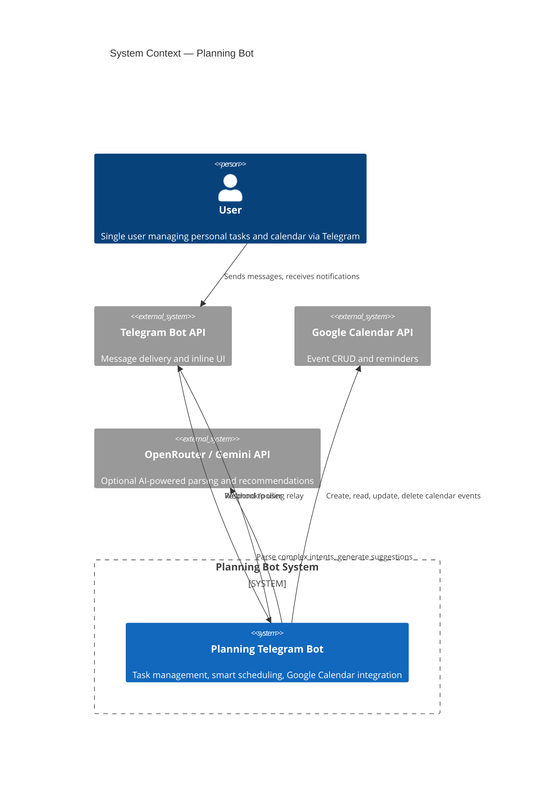
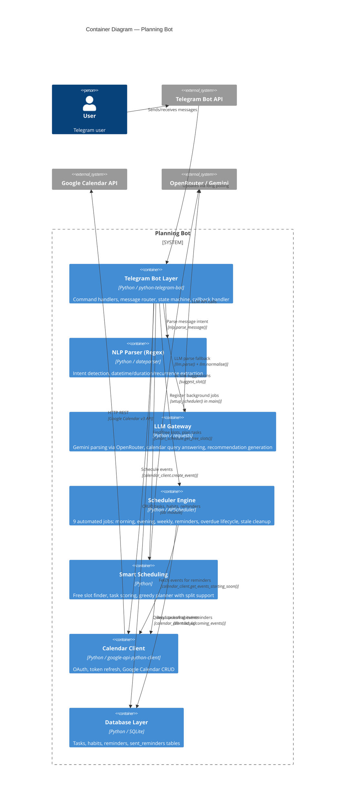
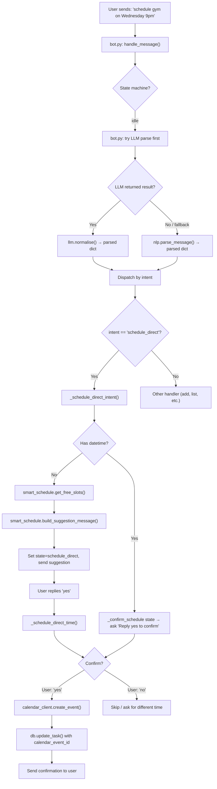
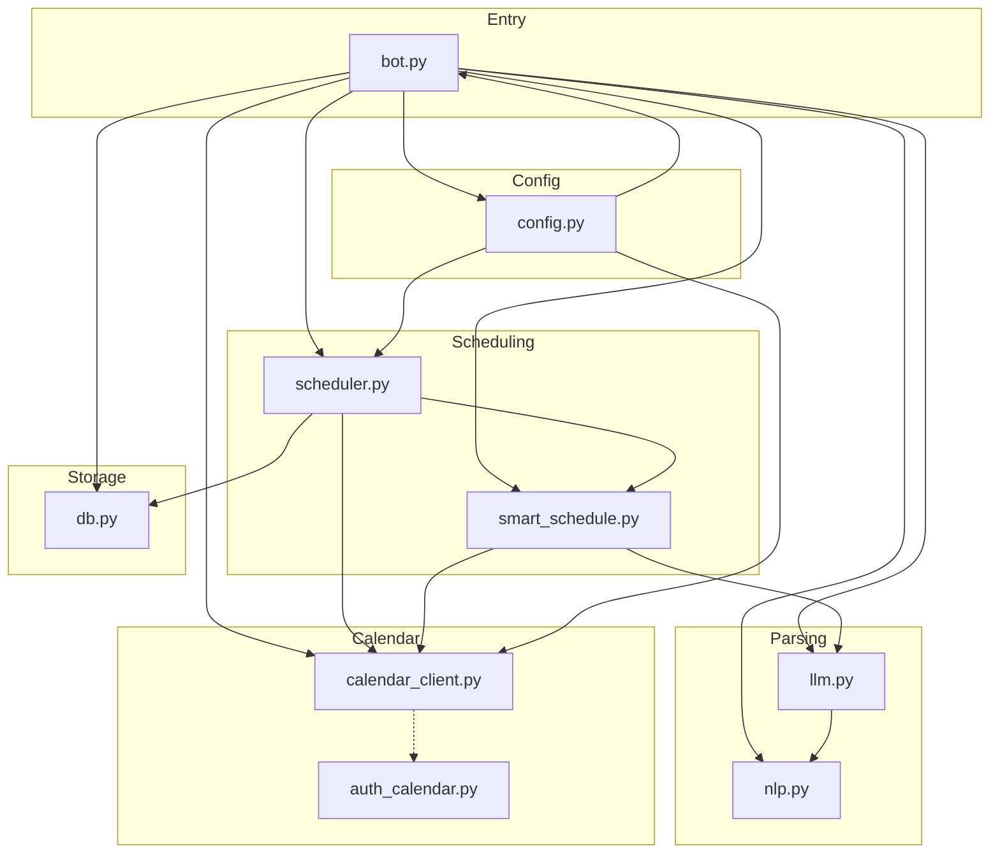

# 📋 Planning Bot

> A Telegram bot for personal task management with natural language input, smart scheduling, and Google Calendar integration.

<p align="center">
  
  
  
  
</p>

---

## 🏗 System Architecture

### Overview

Planning Bot is a personal task management system that accepts natural language input via Telegram, stores tasks in a local SQLite database, and schedules them into Google Calendar using an intelligent slot-finding engine. The bot runs automated daily, weekly, and minutely jobs (morning briefings, evening planning prompts, calendar reminders, overdue task lifecycle, stale event cleanup) via APScheduler.

**Target users:** Single-user (gated by `ALLOWED_USER_ID`). Designed for personal productivity — one person managing their own tasks, calendar, and habits.

**Real-world problem:** Most task managers require structured input, manual calendar blocking, and separate apps for tasks vs. calendar. This bot provides a unified interface where the user types natural language ("finish report by next Friday needs 2 hours"), the system parses the intent, stores the task, finds free Google Calendar slots, and suggests placements — all within Telegram.

**Key technical features:**
- Natural language parsing via regex (primary) and optional LLM (Gemini via OpenRouter)
- Google Calendar CRUD with OAuth 2.0 token refresh
- Smart scheduling with sleep/meal blocking, task scoring by deadline/priority/category/energy
- 9 automated background jobs (APScheduler)
- Overdue task lifecycle (reminder at day 1, warning at day 7, auto-delete at day 8+)
- Recurring events and reminders
- Inline "Done" and "Undo" buttons

---

### Context Diagram



**How it works:** The user sends a Telegram message to the bot. The message flows through Telegram's infrastructure to the running Python application. The bot parses the intent (either via regex NLP or via Gemini LLM), executes the appropriate handler (add task, list tasks, schedule into calendar, etc.), and sends a response back through Telegram.

**External dependencies:** The system depends on three external services: Telegram Bot API for message delivery, Google Calendar API for event management, and optionally OpenRouter (Gemini) for advanced parsing and recommendations. All three are accessed over HTTPS — the system has no direct user-facing web interface.

---

### Container Diagram



#### Container Descriptions

| Container | File(s) | Purpose | Input | Output |
|-----------|---------|---------|-------|--------|
| **Telegram Bot Layer** | `bot.py` | Entry point. Routes messages to handlers, manages state machine (scheduling flow, confirmation, editing). Handles inline button callbacks (Done, Undo, Plan). | Telegram updates (text, callbacks), env config | Telegram responses (text, markdown, inline keyboards) |
| **NLP Parser (Regex)** | `nlp.py` | Regex-based intent detection (18 intent patterns), datetime extraction with 8 fallback strategies, duration/recurrence/reminder parsing. Primary parsing path. | Raw user text | Structured dict with intent, title, datetime, duration, recurrence, category, energy, splittable |
| **LLM Gateway** | `llm.py` | Optional Gemini 2.5 Flash Lite via OpenRouter. Handles complex multi-intent messages, calendar queries, and generates weekly/daily recommendations. Falls back to regex on failure. | User text + optional conversation context | Parsed JSON dict; natural language answers for calendar queries |
| **Scheduler Engine** | `scheduler.py` | 9 APScheduler jobs: morning briefing, midday urgency check, evening planning, Sunday weekly review, Sunday weekly planning, calendar reminders (1 min), app reminders (1 min), overdue task lifecycle (daily), stale event cleanup (1 hr). | APScheduler triggers | Telegram messages to user, database updates |
| **Smart Scheduling** | `smart_schedule.py` | Free slot finder (respects sleep 11pm-7am, soft-blocks meals). Task scoring by deadline pressure, category fit, energy level. Greedy planner with split support. AI slot suggestion via Gemini. | Calendar events + task properties | Free slot list, ranked task-slot assignments, natural language plan |
| **Calendar Client** | `calendar_client.py` | Full Google Calendar CRUD. OAuth 2.0 with automatic token refresh. Custom reminder minutes. Recurring event support. List, search, reschedule events. | Event properties (title, start, duration, reminder, rrule) | Calendar event ID |
| **Database Layer** | `db.py` | SQLite with 4 tables: `tasks` (priority, deadline, category, energy, scheduled times), `habits` (frequency, count), `reminders` (title, remind_at, recurrence), `sent_reminders` (dedup key). 30+ query functions. | SQL queries | Row objects with dict-like access (sqlite3.Row) |

---

### Scheduling Workflow



**Step-by-step walkthrough:**

1. **Message ingestion**: The user sends a natural language message via Telegram. `bot.py:handle_message()` receives the `Update` object.

2. **State machine check**: If the user is in a conversation state (e.g., confirming a schedule, providing a time), the state-specific handler processes the input directly without re-parsing.

3. **LLM parse (primary)**: `llm.parse()` sends the message to Gemini 2.5 Flash Lite via OpenRouter. The system prompt defines 18 possible intents, extraction rules, and time-of-day mappings. Returns structured JSON.

4. **Regex fallback**: If the LLM is unavailable (no API key, timeout, rate limit) or returns no result, `nlp.parse_message()` applies regex-based intent detection and datetime extraction with 8 fallback strategies.

5. **Intent dispatch**: The parsed intent routes to the appropriate handler. For scheduling, `_schedule_direct_intent()` checks if a datetime was provided.

6. **Free slot detection**: If no time was given, `smart_schedule.get_free_slots()` queries Google Calendar for upcoming events, builds busy blocks, and returns free windows respecting sleep (11pm–7am) and meal times. Each slot includes start, end, and duration.

7. **Slot suggestion**: `build_suggestion_message()` optionally calls Gemini to pick the best slot based on task type. The top suggestion is presented with alternative options.

8. **User confirmation**: The bot enters `confirm_schedule` state, showing the proposed time, duration, and reminder setting. The user replies "yes" to confirm or "no" to cancel.

9. **Calendar event creation**: `calendar_client.create_event()` calls the Google Calendar v3 API with the event body (title, start/end datetimes, reminder overrides, optional recurrence rule).

10. **Database update**: `db.update_task()` records the `calendar_event_id`, `scheduled_start`, and `scheduled_end`, and sets status to `in_progress`.

---

### Module Dependencies



**Import relationships:** `bot.py` is the central hub, importing 6 of the 7 other modules. `scheduler.py` imports `db` and conditionally imports `calendar_client` and `smart_schedule` (lazy imports to prevent auth failures from crashing scheduler startup). `smart_schedule.py` imports `calendar_client` directly and `requests` for Gemini calls. `llm.py` conditionally imports `nlp.py` as a fallback helper. `config.py` is a thin dotenv loader consumed by `bot.py`, `scheduler.py`, and `calendar_client.py`.

---

### Deployment

```mermaid
deployment
    title Deployment — Planning Bot on Linux VPS

    node "User Device" as user_dev {
        node "Telegram Client" as tg_client
    }

    node "Internet" as internet {
        node "Telegram Platform" as tg_platform
        node "Google APIs" as google {
            node "Google Calendar API" as gcal_api
        }
        node "OpenRouter" as openrouter {
            node "Gemini API" as gemini_api
        }
    }

    node "Linux VPS (Ubuntu/Debian)" as vps {
        node "systemd" as systemd {
            node "planner-bot.service" as service
        }

        node "Python Runtime 3.10+" as python {
            node "Main Process" as bot_process {
                node "bot.py" as bot_main
                node "scheduler jobs" as jobs
            }
        }

        node "File System" as fs {
            node "/opt/planner_bot/" as app_dir {
                node ".env" as env_file
                node "token.json" as token_file
            }
            node "SQLite Database" as db_file
        }
    }

    tg_client --> tg_platform
    tg_platform --> bot_main
    bot_main --> tg_platform
    bot_main --> gcal_api
    bot_main --> gemini_api
    bot_main --> db_file
    jobs --> gcal_api
    jobs --> db_file
    env_file --> bot_main
    token_file --> bot_main
    service --> bot_process
```

**Production setup:** The bot runs as a systemd service on a headless Linux VPS (Ubuntu/Debian). The `oracle-planner.service` unit sets `WorkingDirectory=/opt/planner_bot`, loads `.env` as the environment file, and runs `venv/bin/python bot.py` with automatic restart on failure. The Google Calendar `token.json` is generated locally via `auth_calendar.py` (which requires a browser for OAuth consent) and then copied to the server via SCP. The SQLite database persists tasks, habits, and reminders. All three external services (Telegram, Google Calendar, OpenRouter) are accessed over HTTPS outbound — no inbound ports are required beyond standard SSH for administration.

---

### Key Components

| Component | File(s) | Responsibility |
|-----------|---------|----------------|
| Telegram Bot Layer | `bot.py` | Entry point, command handlers (20+), message router, state machine (idle/scheduling/confirm/editing/clarifying), inline callback handler (Done/Undo/Plan), reply-to-edit |
| NLP Parser (Regex) | `nlp.py` | 18 intent patterns, datetime extraction (8 strategies), duration/recurrence/reminder parsing, category/energy inference, multi-slot detection |
| LLM Gateway | `llm.py` | Gemini 2.5 Flash Lite via OpenRouter, intent normalisation, calendar query answering |
| Scheduler Engine | `scheduler.py` | 9 APScheduler jobs: morning briefing, midday urgency, evening planning, Sunday weekly review, Sunday planning (with inline buttons), calendar reminders (1 min), app reminders (1 min), overdue lifecycle (daily), stale event cleanup (1 hr) |
| Smart Scheduling | `smart_schedule.py` | Free slot finder (sleep 11pm-7am blocked, meals soft-blocked), task scoring (deadline pressure, category fit, energy level), greedy planner with split support, AI slot suggester |
| Calendar Client | `calendar_client.py` | Google Calendar v3 API: OAuth 2.0 token refresh, create/update/delete events, recurring events, custom reminders, list/search/reschedule events |
| Database Layer | `db.py` | SQLite CRUD: 4 tables (tasks, habits, reminders, sent_reminders), 30+ query functions, auto-migration via `_ensure_column()` |
| Auth Script | `auth_calendar.py` | One-time OAuth 2.0 consent flow, writes `token.json` |
| Configuration | `config.py` | Loads env vars from `.env` via python-dotenv, exports TELEGRAM_TOKEN, ALLOWED_USER_ID, TIMEZONE, DB_PATH, OPENROUTER_API_KEY |

### Technology Stack

| Category | Technology |
|----------|------------|
| **Runtime** | Python 3.10+ |
| **Telegram API** | python-telegram-bot 21.5 |
| **Google Calendar API** | google-api-python-client 2.127.0, google-auth-oauthlib 1.2.0 |
| **Scheduling** | APScheduler 3.10.4 |
| **Database** | SQLite (via sqlite3 stdlib) |
| **NLP (Primary)** | dateparser 1.2.0, python-dateutil 2.9.0, pytz 2024.1 |
| **LLM (Optional)** | requests (OpenRouter / Gemini 2.5 Flash Lite) |
| **Configuration** | python-dotenv 1.0.1 |
| **Deployment** | systemd (Linux VPS), Railway |

## ✨ Features

| Category | Feature | Description |
|----------|---------|-------------|
| 🗣️ **Input** | Natural Language | Type `finish report by next Friday` — no rigid syntax |
| 📦 **Storage** | Two-Layer | Tasks live in SQLite; only scheduled ones go to Google Calendar |
| 📅 **Scheduling** | Smart Planner | Finds free slots, matches tasks by deadline/priority/category, supports splitting |
| 🔁 **Recurring** | Events & Reminders | `every Monday at 9am`, `every tuesday until May 5` |
| ⏰ **Reminders** | Bot-Side | Sent by Telegram without blocking calendar time |
| 🔔 **Calendar** | Google Calendar | Full CRUD, recurring events, custom reminder times |
| 🧠 **AI** | LLM Parsing | Optional Gemini integration for smarter intent detection |
| 🏋️ **Habits** | Daily & Weekly | Track habits with counts, shown in morning/evening/Sunday prompts |
| 🗑️ **Overdue** | Auto-Lifecycle | Remind on day 1, warn on day 7, auto-delete on day 8+ |
| ↩️ **Undo** | Inline Buttons | Every "Done" action includes an undo button |
| ⏸️ **Pause/Resume** | Multi-Task | Pause batch scheduling and resume later with `resume` |
| 🧹 **Cleanup** | Stale Events | Hourly check removes orphaned calendar references |

---

## 🚀 Quick Start

### 1. Clone & Install

```bash
git clone https://github.com/Phantom-curly/scheduler.git
cd scheduler
python3 -m venv venv
source venv/bin/activate   # Windows: venv\Scripts\activate
pip install -r requirements.txt
```

### 2. Create Your Telegram Bot

1. Open Telegram → search `@BotFather`
2. Send `/newbot` and follow the prompts
3. Copy the token — you'll need it in `.env`
4. Get your user ID from `@userinfobot`

### 3. Set Up Google Calendar API

#### Prerequisites

- A Google account.
- A machine with a browser (your local laptop) to perform the one-time OAuth consent flow.
- The headless server where the bot runs does **not** need a browser.

#### Google Cloud OAuth Setup

1. Go to [Google Cloud Console](https://console.cloud.google.com).
2. Create a project → **APIs & Services** → **Enable APIs**.
3. Enable the **Google Calendar API**.
4. Go to **Credentials** → **Create Credentials** → **OAuth 2.0 Client ID**.
5. Application type: **Desktop app**.
6. Download the JSON file → rename it to `credentials.json` → place it in the project root.

`credentials.json` is only needed during the one-time authentication step. It is **not** required on the server at runtime.

#### Generating `token.json` (on your local machine)

1. Make sure `credentials.json` is in the project root on your **local** machine.
2. Run the authentication helper:

   ```bash
   python auth_calendar.py
   ```

3. Your browser opens. Sign in with the Google account that owns the target calendar.
4. Allow the requested permissions. The script writes `token.json` to the project root.

   `token.json` is the **only** authentication artifact the bot reads at runtime. There is no base64-encoding step and no `GOOGLE_TOKEN_B64` environment variable.

#### Verifying the Token

After generating `token.json`, test that the refresh cycle works:

```bash
python -c "
from google.oauth2.credentials import Credentials
from google.auth.transport.requests import Request
creds = Credentials.from_authorized_user_file('token.json', ['https://www.googleapis.com/auth/calendar'])
if creds.expired:
    creds.refresh(Request())
print('Token is valid and refreshable.')
"
```

If this prints the success message, the token is ready for deployment.

#### Deploying `token.json` to a Headless VPS

1. Copy `token.json` from your local machine to the server:

   ```bash
   scp token.json user@your-server:/opt/planner_bot/token.json
   ```

2. On the server, set `GOOGLE_TOKEN_PATH` in `.env` to point to the file:

   ```
   GOOGLE_TOKEN_PATH=/opt/planner_bot/token.json
   ```

3. Restart the bot service:

   ```bash
   sudo systemctl restart planner-bot
   sudo systemctl status planner-bot
   ```

#### Token Lifecycle & Troubleshooting

Google may revoke a refresh token for any of these reasons:

- The token has not been used for 6 months.
- The user revoked access at [Google Account → Security → Third-party apps](https://myaccount.google.com/permissions).
- The OAuth consent screen settings were changed in Google Cloud Console.
- The app is in **"testing"** mode — tokens issued in testing mode expire after 7 days. Switch the app to **"in production"** in the OAuth consent screen settings to get long-lived tokens.

##### Symptoms of an invalid token

The bot logs will show:

```
ERROR | Google OAuth refresh token is invalid or revoked. …
google.auth.exceptions.RefreshError: invalid_grant: Token has been expired or revoked.
```

Calendar operations will fail until the token is replaced.

##### Recovery steps

1. On your **local** machine, delete the old token and re-authenticate:

   ```bash
   rm token.json
   python auth_calendar.py
   ```

2. Verify the new token (see "Verifying the Token" above).
3. Copy the fresh `token.json` to the server with `scp`.
4. Restart the bot service.

No code changes or redeployment are required — just replace the file.

#### Security Recommendations

- **Never commit** `.env`, `token.json`, or `credentials.json`. They are listed in `.gitignore`.
- On the server, set `token.json` to mode `600` so only the bot process user can read it:

  ```bash
  chmod 600 /opt/planner_bot/token.json
  ```

- Use a dedicated Google account for the bot rather than a personal account, so you can revoke access independently.
- If a token is ever leaked, revoke it immediately at [Google Account permissions](https://myaccount.google.com/permissions) and generate a new one. The old token becomes invalid instantly.
- Rotate the token every 3–6 months to ensure it never reaches Google's inactivity expiry window.

---

### 4. Configure Environment

```bash
cp .env.example .env
# Edit .env with your values
```

| Variable | Required | Description |
|----------|----------|-------------|
| `TELEGRAM_TOKEN` | ✅ | Token from @BotFather |
| `ALLOWED_USER_ID` | ✅ | Your Telegram user ID (from @userinfobot) |
| `GOOGLE_TOKEN_PATH` | ✅ | Path to `token.json` (e.g. `/opt/planner_bot/token.json`) |
| `GOOGLE_CALENDAR_ID` | ❌ | Default: `primary` |
| `TIMEZONE` | ❌ | Default: `Asia/Seoul` |
| `MORNING_TIME` | ❌ | Morning briefing time, default `08:00` |
| `OPENROUTER_API_KEY` | ❌ | For LLM-powered parsing & planning |
| `DB_PATH` | ❌ | SQLite path, default `planner.db` |

### 5. Run Locally

```bash
python bot.py
```

---

## 💬 Usage

### Natural Language Patterns

| You Say | Bot Does |
|---------|----------|
| `finish report by next Friday` | Add task with deadline |
| `review PRs by Wednesday 3pm` | Add task with deadline + time |
| `call dentist` | Add task, no deadline |
| `add report by Friday needs 2 hours` | Add task with deadline + effort estimate |
| `what do I have this week?` | List this week's tasks |
| `what tasks do I have today?` | List today's tasks |
| `show all tasks` | List all pending tasks |
| `schedule 1 2 3` | Schedule tasks 1, 2, 3 from last list |
| `schedule running session on Wednesday 9pm` | Direct calendar event |
| `schedule gym tuesday 10pm and friday 9am` | Multi-slot direct scheduling |
| `schedule book reading every tuesday at 9 pm until May 5` | Recurring event with end date |
| `find me 2 hours this week` | Show free calendar blocks |
| `plan my unscheduled tasks` | Auto-suggest task placements |
| `yes` (after a plan) | Schedule all suggested blocks |
| `schedule 1 3` (after a plan) | Schedule selected blocks |
| `remind me tomorrow 4pm to check results` | Create Telegram reminder |
| `mark task 1 done` | Complete task |
| `done 2 3` | Complete tasks 2 and 3 |
| `delete task 2` | Delete task (with confirmation) |
| `update task 1 deadline to Monday` | Change deadline |
| `move task 3 to next Thursday` | Reschedule |
| `add weekly habit: gym 2 times` | Add weekly habit |
| `add daily habit: read 30 min` | Add daily habit |
| `resume` | Resume paused batch scheduling |

### Slash Commands

| Command | Description |
|---------|-------------|
| `/tasks` | All pending unscheduled tasks |
| `/today` | Tasks due + calendar events today |
| `/tomorrow` | Tasks due + calendar events tomorrow |
| `/week` | Full week view with tasks + events per day |
| `/habits` | Active daily/weekly habits |
| `/free` | Free calendar blocks |
| `/plan` | Auto-suggested task placements |
| `/now` | Bot's current date/time/timezone |
| `/cancel` | Cancel current operation |
| `/help` | Full usage reference |

### Scheduling Flow Example

```
You:  what do I have this week?
Bot:  📆 This Week's Tasks (3)
      1. ⏳ Finish report — due Fri May 29
      2. ⏳ Review PRs — due Wed May 27
      3. ⏳ Team sync prep — due Thu May 28

You:  schedule 1 3
Bot:  ⏰ Schedule 1/2 — Finish report
      ✨ Best slot: Thu May 28, 2:00 PM – 4:00 PM
      Reply yes to confirm, no for other options.

You:  yes
Bot:  📅 *Confirm schedule:*
      *Finish report*
      📍 Thu May 28, 2:00 PM → 4:00 PM (120 min)
      ⏰ Reminder: 30 min before
      Reply yes to confirm, no to skip.

You:  yes
Bot:  ✅ *Scheduled!*
      *Finish report*
      📍 Thu May 28, 2:00 PM → 4:00 PM (120 min)
      ⏰ Reminder: 30 min before

Bot:  ⏰ Schedule 2/2 — Team sync prep
      ...
```

---

## ⏰ Scheduled Jobs

The bot runs these automated jobs via APScheduler:

| Job | When | What It Does |
|-----|------|-------------|
| ☀️ Morning Briefing | Daily at `MORNING_TIME` | Tasks due today, calendar events, daily habits, unscheduled tasks, AI suggestions |
| ⚠️ Urgency Check | Daily at 12:00 | Alerts for unscheduled tasks due within 24h |
| 🌙 Evening Planning | Daily at 21:00 | Tomorrow's calendar + tasks, today's unfinished, daily habits |
| 📊 Weekly Review | Sunday 20:00 | Completion rate, done/missed tasks, AI reflection |
| 📅 Weekly Planning | Sunday 21:00 | Unscheduled tasks, next week's due items, weekly habits + inline buttons |
| 🔔 Calendar Reminders | Every 1 min | Popup reminders for events starting in ~30 min |
| 🔔 App Reminders | Every 1 min | Sends due bot-side reminders |
| 🗑️ Overdue Check | Daily at 09:00 | Day 1: remind, Day 7: warn, Day 8+: auto-delete |
| 🧹 Stale Cleanup | Every 1 hour | Removes orphaned calendar event references |

---

## 🚢 Deployment

### Headless Linux VPS (systemd)

Production deployment on a headless Ubuntu/Debian VPS.

1. Clone the repo:

   ```bash
   git clone https://github.com/Phantom-curly/scheduler.git /opt/planner_bot
   cd /opt/planner_bot
   python3 -m venv venv
   ./venv/bin/pip install -r requirements.txt
   ```

2. Create and populate `.env`:

   ```bash
   cp .env.example .env
   # Edit .env with your values (see environment table above)
   ```

3. **Deploy `token.json`** — generate it on your local machine (see step 3 above), then copy it to the server:

   ```bash
   scp token.json user@your-server:/opt/planner_bot/token.json
   ```

   On the server, secure the file:

   ```bash
   chmod 600 /opt/planner_bot/token.json
   ```

4. Install as a systemd service:

   ```bash
   sudo cp deploy/oracle-planner.service /etc/systemd/system/planner-bot.service
   sudo systemctl daemon-reload
   sudo systemctl enable --now planner-bot
   sudo systemctl status planner-bot
   ```

5. Check logs:

   ```bash
   sudo journalctl -u planner-bot -f
   ```

### Railway

1. Push code to GitHub (secrets are gitignored).
2. Go to [Railway](https://railway.app) → **New Project** → **Deploy from GitHub**.
3. **Add a Volume** → Mount path: `/data` (persists SQLite and `token.json` across deploys).
4. Add environment variables:

   ```
   TELEGRAM_TOKEN        = <from BotFather>
   ALLOWED_USER_ID       = <your Telegram user ID>
   GOOGLE_TOKEN_PATH     = /data/token.json
   GOOGLE_CALENDAR_ID    = primary
   TIMEZONE              = Asia/Seoul
   DB_PATH               = /data/planner.db
   ```

5. **Deploy `token.json`**: generate it locally with `python auth_calendar.py`, then upload to `/data/token.json` on the Railway volume (`railway run cp token.json /data/token.json`).

---

## 📁 Project Structure

```
scheduler/
├── bot.py                # Telegram handlers + state machine (1800+ lines)
├── nlp.py                # Intent detection, datetime/duration/recurrence parsing
├── db.py                 # SQLite CRUD for tasks, habits, reminders
├── calendar_client.py    # Google Calendar API wrapper (CRUD + recurring)
├── smart_schedule.py     # Free slot finder, task planner, AI recommendations
├── scheduler.py          # APScheduler jobs (9 automated tasks)
├── config.py             # Environment variable loading
├── auth_calendar.py      # One-time OAuth script for Google Calendar
├── llm.py                # OpenRouter/Gemini integration for NL parsing
├── requirements.txt      # Python dependencies
├── Procfile              # Railway process definition
├── .env.example          # Environment variable template
├── .gitignore            # Secrets, DB, caches, venvs
├── deploy/
│   └── oracle-planner.service  # systemd service template
└── planner/              # Additional planning utilities
```

---

## 🛠 Tech Stack

| Technology | Purpose |
|------------|---------|
| **Python 3.10+** | Runtime |
| **python-telegram-bot** | Telegram API (v20+, async) |
| **Google Calendar API** | Calendar CRUD + reminders |
| **APScheduler** | Cron-like job scheduling |
| **SQLite** | Local task/habit/reminder storage |
| **OpenRouter / Gemini** | Optional LLM for NL parsing & planning |
| **dateparser** | Flexible datetime extraction |
| **Railway** | Recommended cloud deployment |

---

## 🔒 Security

- **Single-user**: All commands are gated by `ALLOWED_USER_ID`
- **Secrets gitignored**: `.env`, `token.json`, `credentials.json` never committed
- **Database gitignored**: `planner.db` stays local
- **Lazy imports**: Google Calendar and AI modules imported only when needed — auth failures don't crash the bot

---

## 📄 License

MIT
