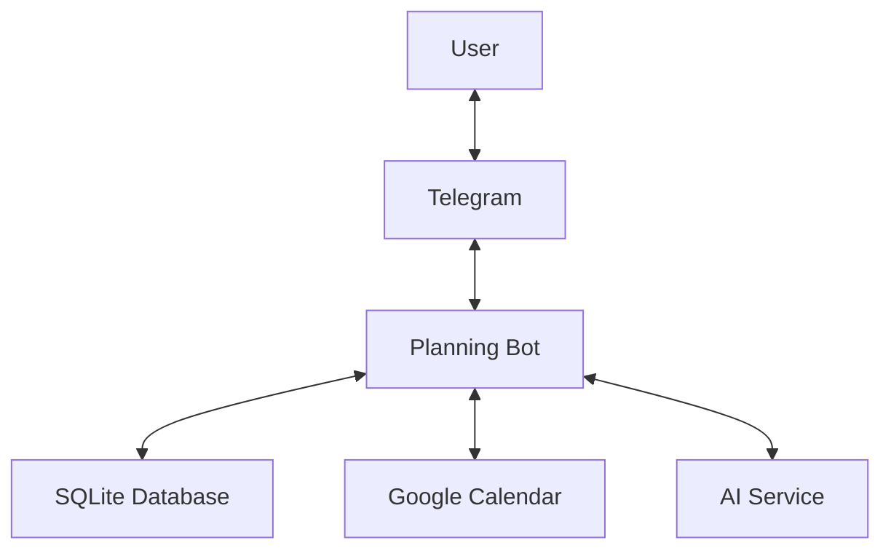
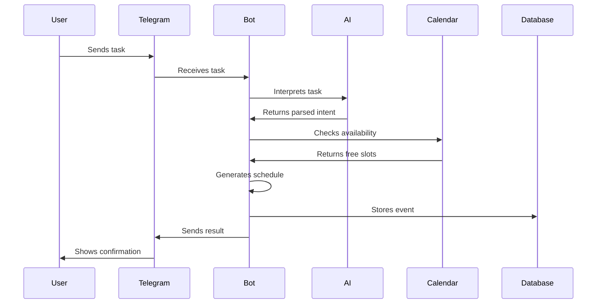

# 📋 Planning Bot

> A Telegram bot for personal task management with natural language input, smart scheduling, and Google Calendar integration.

<p align="center">
  
  
  
  
</p>

---

## 🏗 System Architecture

The following diagrams provide a high-level overview of the system architecture and scheduling workflow. They intentionally focus on the main components and interactions rather than implementation details.

### Diagram 1 — System Architecture



### Diagram 2 — Scheduling Workflow



### Key Components

| Category | Technology |
|----------|------------|
| **Runtime** | Python 3.10+ |
| **Telegram API** | python-telegram-bot 21.5 |
| **Google Calendar API** | google-api-python-client 2.127.0, google-auth-oauthlib 1.2.0 |
| **Scheduling** | APScheduler 3.10.4 |
| **Database** | SQLite (via sqlite3 stdlib) |
| **NLP (Primary)** | dateparser 1.2.0, python-dateutil 2.9.0, pytz 2024.1 |
| **LLM (Optional)** | requests (OpenRouter / Gemini 2.5 Flash Lite) |
| **Configuration** | python-dotenv 1.0.1 |
| **Deployment** | systemd (Linux VPS), Railway |

## ✨ Features

| Category | Feature | Description |
|----------|---------|-------------|
| 🗣️ **Input** | Natural Language | Type `finish report by next Friday` — no rigid syntax |
| 📦 **Storage** | Two-Layer | Tasks live in SQLite; only scheduled ones go to Google Calendar |
| 📅 **Scheduling** | Smart Planner | Finds free slots, matches tasks by deadline/priority/category, supports splitting |
| 🔁 **Recurring** | Events & Reminders | `every Monday at 9am`, `every tuesday until May 5` |
| ⏰ **Reminders** | Bot-Side | Sent by Telegram without blocking calendar time |
| 🔔 **Calendar** | Google Calendar | Full CRUD, recurring events, custom reminder times |
| 🧠 **AI** | LLM Parsing | Optional Gemini integration for smarter intent detection |
| 🏋️ **Habits** | Daily & Weekly | Track habits with counts, shown in morning/evening/Sunday prompts |
| 🗑️ **Overdue** | Auto-Lifecycle | Remind on day 1, warn on day 7, auto-delete on day 8+ |
| ↩️ **Undo** | Inline Buttons | Every "Done" action includes an undo button |
| ⏸️ **Pause/Resume** | Multi-Task | Pause batch scheduling and resume later with `resume` |
| 🧹 **Cleanup** | Stale Events | Hourly check removes orphaned calendar references |

---

## 🚀 Quick Start

### 1. Clone & Install

```bash
git clone https://github.com/Phantom-curly/scheduler.git
cd scheduler
python3 -m venv venv
source venv/bin/activate   # Windows: venv\Scripts\activate
pip install -r requirements.txt
```

### 2. Create Your Telegram Bot

1. Open Telegram → search `@BotFather`
2. Send `/newbot` and follow the prompts
3. Copy the token — you'll need it in `.env`
4. Get your user ID from `@userinfobot`

### 3. Set Up Google Calendar API

#### Prerequisites

- A Google account.
- A machine with a browser (your local laptop) to perform the one-time OAuth consent flow.
- The headless server where the bot runs does **not** need a browser.

#### Google Cloud OAuth Setup

1. Go to [Google Cloud Console](https://console.cloud.google.com).
2. Create a project → **APIs & Services** → **Enable APIs**.
3. Enable the **Google Calendar API**.
4. Go to **Credentials** → **Create Credentials** → **OAuth 2.0 Client ID**.
5. Application type: **Desktop app**.
6. Download the JSON file → rename it to `credentials.json` → place it in the project root.

`credentials.json` is only needed during the one-time authentication step. It is **not** required on the server at runtime.

#### Generating `token.json` (on your local machine)

1. Make sure `credentials.json` is in the project root on your **local** machine.
2. Run the authentication helper:

   ```bash
   python auth_calendar.py
   ```

3. Your browser opens. Sign in with the Google account that owns the target calendar.
4. Allow the requested permissions. The script writes `token.json` to the project root.

   `token.json` is the **only** authentication artifact the bot reads at runtime. There is no base64-encoding step and no `GOOGLE_TOKEN_B64` environment variable.

#### Verifying the Token

After generating `token.json`, test that the refresh cycle works:

```bash
python -c "
from google.oauth2.credentials import Credentials
from google.auth.transport.requests import Request
creds = Credentials.from_authorized_user_file('token.json', ['https://www.googleapis.com/auth/calendar'])
if creds.expired:
    creds.refresh(Request())
print('Token is valid and refreshable.')
"
```

If this prints the success message, the token is ready for deployment.

#### Deploying `token.json` to a Headless VPS

1. Copy `token.json` from your local machine to the server:

   ```bash
   scp token.json user@your-server:/opt/planner_bot/token.json
   ```

2. On the server, set `GOOGLE_TOKEN_PATH` in `.env` to point to the file:

   ```
   GOOGLE_TOKEN_PATH=/opt/planner_bot/token.json
   ```

3. Restart the bot service:

   ```bash
   sudo systemctl restart planner-bot
   sudo systemctl status planner-bot
   ```

#### Token Lifecycle & Troubleshooting

Google may revoke a refresh token for any of these reasons:

- The token has not been used for 6 months.
- The user revoked access at [Google Account → Security → Third-party apps](https://myaccount.google.com/permissions).
- The OAuth consent screen settings were changed in Google Cloud Console.
- The app is in **"testing"** mode — tokens issued in testing mode expire after 7 days. Switch the app to **"in production"** in the OAuth consent screen settings to get long-lived tokens.

##### Symptoms of an invalid token

The bot logs will show:

```
ERROR | Google OAuth refresh token is invalid or revoked. …
google.auth.exceptions.RefreshError: invalid_grant: Token has been expired or revoked.
```

Calendar operations will fail until the token is replaced.

##### Recovery steps

1. On your **local** machine, delete the old token and re-authenticate:

   ```bash
   rm token.json
   python auth_calendar.py
   ```

2. Verify the new token (see "Verifying the Token" above).
3. Copy the fresh `token.json` to the server with `scp`.
4. Restart the bot service.

No code changes or redeployment are required — just replace the file.

#### Security Recommendations

- **Never commit** `.env`, `token.json`, or `credentials.json`. They are listed in `.gitignore`.
- On the server, set `token.json` to mode `600` so only the bot process user can read it:

  ```bash
  chmod 600 /opt/planner_bot/token.json
  ```

- Use a dedicated Google account for the bot rather than a personal account, so you can revoke access independently.
- If a token is ever leaked, revoke it immediately at [Google Account permissions](https://myaccount.google.com/permissions) and generate a new one. The old token becomes invalid instantly.
- Rotate the token every 3–6 months to ensure it never reaches Google's inactivity expiry window.

---

### 4. Configure Environment

```bash
cp .env.example .env
# Edit .env with your values
```

| Variable | Required | Description |
|----------|----------|-------------|
| `TELEGRAM_TOKEN` | ✅ | Token from @BotFather |
| `ALLOWED_USER_ID` | ✅ | Your Telegram user ID (from @userinfobot) |
| `GOOGLE_TOKEN_PATH` | ✅ | Path to `token.json` (e.g. `/opt/planner_bot/token.json`) |
| `GOOGLE_CALENDAR_ID` | ❌ | Default: `primary` |
| `TIMEZONE` | ❌ | Default: `Asia/Seoul` |
| `MORNING_TIME` | ❌ | Morning briefing time, default `08:00` |
| `OPENROUTER_API_KEY` | ❌ | For LLM-powered parsing & planning |
| `DB_PATH` | ❌ | SQLite path, default `planner.db` |

### 5. Run Locally

```bash
python bot.py
```

---

## 💬 Usage

### Natural Language Patterns

| You Say | Bot Does |
|---------|----------|
| `finish report by next Friday` | Add task with deadline |
| `review PRs by Wednesday 3pm` | Add task with deadline + time |
| `call dentist` | Add task, no deadline |
| `add report by Friday needs 2 hours` | Add task with deadline + effort estimate |
| `what do I have this week?` | List this week's tasks |
| `what tasks do I have today?` | List today's tasks |
| `show all tasks` | List all pending tasks |
| `schedule 1 2 3` | Schedule tasks 1, 2, 3 from last list |
| `schedule running session on Wednesday 9pm` | Direct calendar event |
| `schedule gym tuesday 10pm and friday 9am` | Multi-slot direct scheduling |
| `schedule book reading every tuesday at 9 pm until May 5` | Recurring event with end date |
| `find me 2 hours this week` | Show free calendar blocks |
| `plan my unscheduled tasks` | Auto-suggest task placements |
| `yes` (after a plan) | Schedule all suggested blocks |
| `schedule 1 3` (after a plan) | Schedule selected blocks |
| `remind me tomorrow 4pm to check results` | Create Telegram reminder |
| `mark task 1 done` | Complete task |
| `done 2 3` | Complete tasks 2 and 3 |
| `delete task 2` | Delete task (with confirmation) |
| `update task 1 deadline to Monday` | Change deadline |
| `move task 3 to next Thursday` | Reschedule |
| `add weekly habit: gym 2 times` | Add weekly habit |
| `add daily habit: read 30 min` | Add daily habit |
| `resume` | Resume paused batch scheduling |

### Slash Commands

| Command | Description |
|---------|-------------|
| `/tasks` | All pending unscheduled tasks |
| `/today` | Tasks due + calendar events today |
| `/tomorrow` | Tasks due + calendar events tomorrow |
| `/week` | Full week view with tasks + events per day |
| `/habits` | Active daily/weekly habits |
| `/free` | Free calendar blocks |
| `/plan` | Auto-suggested task placements |
| `/now` | Bot's current date/time/timezone |
| `/cancel` | Cancel current operation |
| `/help` | Full usage reference |

### Scheduling Flow Example

```
You:  what do I have this week?
Bot:  📆 This Week's Tasks (3)
      1. ⏳ Finish report — due Fri May 29
      2. ⏳ Review PRs — due Wed May 27
      3. ⏳ Team sync prep — due Thu May 28

You:  schedule 1 3
Bot:  ⏰ Schedule 1/2 — Finish report
      ✨ Best slot: Thu May 28, 2:00 PM – 4:00 PM
      Reply yes to confirm, no for other options.

You:  yes
Bot:  📅 *Confirm schedule:*
      *Finish report*
      📍 Thu May 28, 2:00 PM → 4:00 PM (120 min)
      ⏰ Reminder: 30 min before
      Reply yes to confirm, no to skip.

You:  yes
Bot:  ✅ *Scheduled!*
      *Finish report*
      📍 Thu May 28, 2:00 PM → 4:00 PM (120 min)
      ⏰ Reminder: 30 min before

Bot:  ⏰ Schedule 2/2 — Team sync prep
      ...
```

---

## ⏰ Scheduled Jobs

The bot runs these automated jobs via APScheduler:

| Job | When | What It Does |
|-----|------|-------------|
| ☀️ Morning Briefing | Daily at `MORNING_TIME` | Tasks due today, calendar events, daily habits, unscheduled tasks, AI suggestions |
| ⚠️ Urgency Check | Daily at 12:00 | Alerts for unscheduled tasks due within 24h |
| 🌙 Evening Planning | Daily at 21:00 | Tomorrow's calendar + tasks, today's unfinished, daily habits |
| 📊 Weekly Review | Sunday 20:00 | Completion rate, done/missed tasks, AI reflection |
| 📅 Weekly Planning | Sunday 21:00 | Unscheduled tasks, next week's due items, weekly habits + inline buttons |
| 🔔 Calendar Reminders | Every 1 min | Popup reminders for events starting in ~30 min |
| 🔔 App Reminders | Every 1 min | Sends due bot-side reminders |
| 🗑️ Overdue Check | Daily at 09:00 | Day 1: remind, Day 7: warn, Day 8+: auto-delete |
| 🧹 Stale Cleanup | Every 1 hour | Removes orphaned calendar event references |

---

## 🚢 Deployment

### Headless Linux VPS (systemd)

Production deployment on a headless Ubuntu/Debian VPS.

1. Clone the repo:

   ```bash
   git clone https://github.com/Phantom-curly/scheduler.git /opt/planner_bot
   cd /opt/planner_bot
   python3 -m venv venv
   ./venv/bin/pip install -r requirements.txt
   ```

2. Create and populate `.env`:

   ```bash
   cp .env.example .env
   # Edit .env with your values (see environment table above)
   ```

3. **Deploy `token.json`** — generate it on your local machine (see step 3 above), then copy it to the server:

   ```bash
   scp token.json user@your-server:/opt/planner_bot/token.json
   ```

   On the server, secure the file:

   ```bash
   chmod 600 /opt/planner_bot/token.json
   ```

4. Install as a systemd service:

   ```bash
   sudo cp deploy/oracle-planner.service /etc/systemd/system/planner-bot.service
   sudo systemctl daemon-reload
   sudo systemctl enable --now planner-bot
   sudo systemctl status planner-bot
   ```

5. Check logs:

   ```bash
   sudo journalctl -u planner-bot -f
   ```

### Railway

1. Push code to GitHub (secrets are gitignored).
2. Go to [Railway](https://railway.app) → **New Project** → **Deploy from GitHub**.
3. **Add a Volume** → Mount path: `/data` (persists SQLite and `token.json` across deploys).
4. Add environment variables:

   ```
   TELEGRAM_TOKEN        = <from BotFather>
   ALLOWED_USER_ID       = <your Telegram user ID>
   GOOGLE_TOKEN_PATH     = /data/token.json
   GOOGLE_CALENDAR_ID    = primary
   TIMEZONE              = Asia/Seoul
   DB_PATH               = /data/planner.db
   ```

5. **Deploy `token.json`**: generate it locally with `python auth_calendar.py`, then upload to `/data/token.json` on the Railway volume (`railway run cp token.json /data/token.json`).

---

## 📁 Project Structure

```
scheduler/
├── bot.py                # Telegram handlers + state machine (1800+ lines)
├── nlp.py                # Intent detection, datetime/duration/recurrence parsing
├── db.py                 # SQLite CRUD for tasks, habits, reminders
├── calendar_client.py    # Google Calendar API wrapper (CRUD + recurring)
├── smart_schedule.py     # Free slot finder, task planner, AI recommendations
├── scheduler.py          # APScheduler jobs (9 automated tasks)
├── config.py             # Environment variable loading
├── auth_calendar.py      # One-time OAuth script for Google Calendar
├── llm.py                # OpenRouter/Gemini integration for NL parsing
├── requirements.txt      # Python dependencies
├── Procfile              # Railway process definition
├── .env.example          # Environment variable template
├── .gitignore            # Secrets, DB, caches, venvs
├── deploy/
│   └── oracle-planner.service  # systemd service template
└── planner/              # Additional planning utilities
```

---

## 🛠 Tech Stack

| Technology | Purpose |
|------------|---------|
| **Python 3.10+** | Runtime |
| **python-telegram-bot** | Telegram API (v20+, async) |
| **Google Calendar API** | Calendar CRUD + reminders |
| **APScheduler** | Cron-like job scheduling |
| **SQLite** | Local task/habit/reminder storage |
| **OpenRouter / Gemini** | Optional LLM for NL parsing & planning |
| **dateparser** | Flexible datetime extraction |
| **Railway** | Recommended cloud deployment |

---

## 🔒 Security

- **Single-user**: All commands are gated by `ALLOWED_USER_ID`
- **Secrets gitignored**: `.env`, `token.json`, `credentials.json` never committed
- **Database gitignored**: `planner.db` stays local
- **Lazy imports**: Google Calendar and AI modules imported only when needed — auth failures don't crash the bot

---

## 📄 License

MIT
